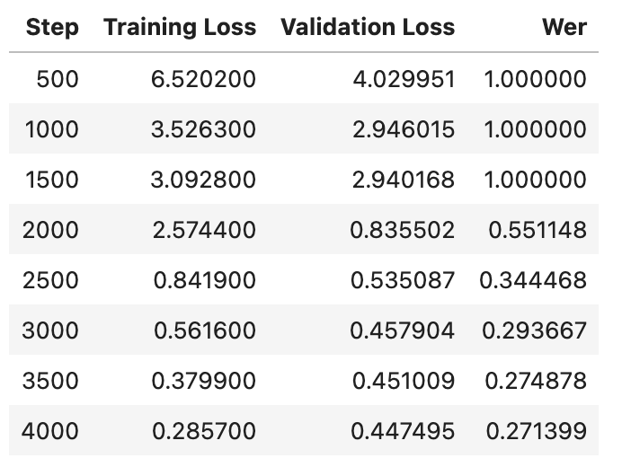

# cse256_finalproject  

Here is the Colab notebook I used to train my model: https://colab.research.google.com/drive/1NpXfALbXDKw6JA9bZhxt-I1bWvqvGeVN?usp=drive_link  
It's also in this repo, called **finetune.ipynb**  
Please note I used this tutorial for the basis for my code: [HuggingFace Tutorial](https://huggingface.co/blog/fine-tune-wav2vec2-english)  

**vocab.json** - The vocab that I created for fine-tuning
  
I didn't include this in my paper, but here is how my training went overtime, in terms of loss and eval WER at every 500 steps:  
  
  
**test_robust.py** - the script I used to evaluate the baseline Wav2Vec2-base-960h and my checkpoint on the Speech Accent Archive dataset (please note I can't upload my actual checkpoint because it's too large)  
  
**process_finetune_data.py** - the script I used for dataset creation for the training/eval dataset from L2 Arctic Corpus  
  
Please note that I cannot upload all the audio data, but they can be found here:  
[L2 Arctic Corpus](https://psi.engr.tamu.edu/l2-arctic-corpus/)  
[Speech Accent Archive](https://www.kaggle.com/datasets/rtatman/speech-accent-archive)  
  
The json list datasets I created for training and evaluation:  
Train - **train_sixteenth_noABA.json**  
Eval - **dev_sixteenth_noABA.json**  
